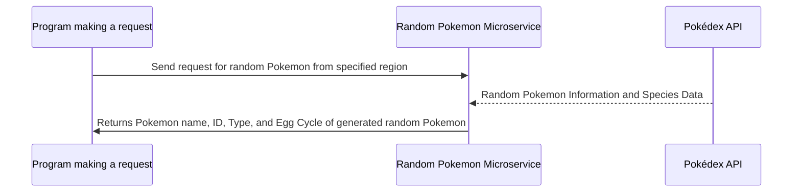

# Random Pokemon API spec

After cloning git repo:

```
cd microserviceA
npm install
npm run dev
```

Routes:

- Random Pokemon in a given region

Go into <http://localhost:3000/{region}>

- Region is region name (e.g. "Kanto")

Returns...

- Name (Random Pokemon's Name)
- id (POKEMON ID, not pokedex number)
- types (string list describing type of Pokemon)
- egg cycles (check species-list under "hatch_counter")

EXAMPLE INPUT

```
{
  "region": "Paldea"
}
```

EXAMPLE OUTPUT

```
{
  "name": "tatsugiri",
  "id": "978",
  "types": ["dragon", "ice"],
  "egg_cycles": "35"
}
```

## UML Sequence Diagram Reference


